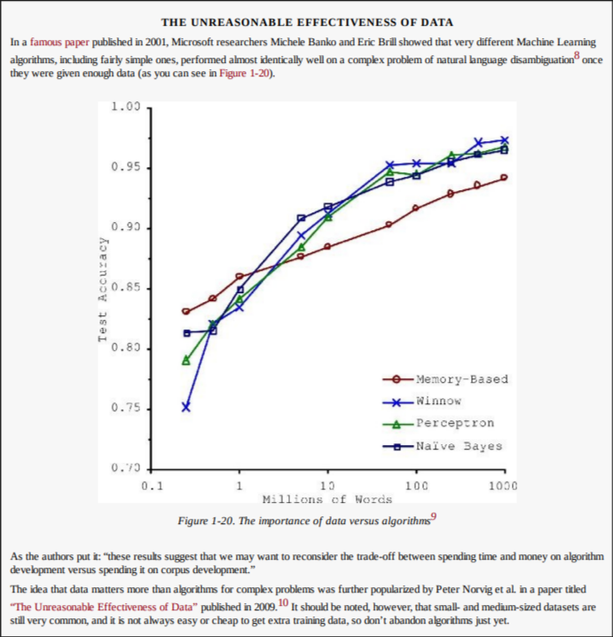

<h1>Problems while training a Model</h1>

<h3>Insufficient quantity of training data</h3>
Since ML is not at a stage where the models can learn seemingly simple things faster than humans. They need a lot of training data to be fed on.
But sometimes collecting, validating and organizing huge amount of data can be really costly, and the model doesn't get trained well due to lack of data quantity.

<h3>
Nonrepresentative Training Data
</h3>
In order to generalize well, it is crucial that your training data be representative of the new cases you
want to generalize to. This is true whether you use instance-based learning or model-based learning. 

Basically, the previous data should represent what kind of data the next will be and of which nature.
<b>Sampling Bias is a huge problem in this</b>

<h3>Poor-Quality Data</h3>
<li>If some instances are clearly outliers, it may help to simply discard them or try to fix the errors
manually.
</li> 
<li>If some instances are missing a few features (e.g., 5% of your customers did not specify their age),
you must decide whether you want to ignore this attribute altogether, ignore these instances, fill in the
missing values (e.g., with the median age), or train one model with the feature and one model without
it, and so on.
</li>

<h3>Irrelevant features</h3>
Garbage in, garbage out
<li>Feature selection: selecting the most useful features to train on among existing features.
</li>
<li>Feature extraction: combining existing features to produce a more useful one</li>
<li>Creating new features by gathering new data</li>

<h2>Overfitting a model</h2>
<i>Overfitting</i> is when a model learns the training data too closely, including noise and random fluctuations, so it performs very well on the training set but poorly on new, unseen data.

A dataset is usually split into two parts. The training set is used to fit the model, and the test set is used to evaluate how well the model generalizes. When overfitting occurs, the training error is low but the test error is high, showing that the model has memorized the training data instead of learning general patterns.

Hyperparameters control the complexity of a model, and complexity strongly affects overfitting. If a model is too simple, it underfits and cannot capture the true structure of the data. If a model is too complex, it can fit noise in the training data and overfit. For example, deeper decision trees, higher-degree polynomials, more neural network layers, or very small k in k-NN all increase the risk of overfitting, while stronger regularization or simpler models reduce it.

In short, overfitting happens when a model is too complex for the available training data, and it is detected by a large gap between training and test performance.

<h2>Underfitting a model</h2>
Underfitting occurs when your model is too simple to
learn the underlying structure of the data. For example, a linear model of life satisfaction is prone to
underfit; reality is just more complex than the model, so its predictions are bound to be inaccurate, even
on the training examples.

 
The main options to fix this problem are:

<li>Selecting a more powerful model, with more parameters</li>
<li>Feeding better features to the learning algorithm (feature engineering)</li>
<li>Reducing the constraints on the model (e.g., reducing the regularization hyperparameter)</li>

